# Hi there, I'm Manthan Shiroya! 👋

<div align="center">


[](https://manthanshiroya.com)
[](https://www.linkedin.com/in/manthan-shiroya-63128816a/)
[](mailto:manthanshiroya53@gmail.com)

</div>

---

## 🚀 About Me

I'm a **self-taught DevOps Engineer and Automation Strategist** on a mission to simplify complexity through intelligent infrastructure design. With **4+ years of hands-on experience**, I specialize in building cloud-native, AI-powered automation systems that transform chaos into streamlined workflows.

```yaml
name: "Manthan Nileshbhai Shiroya"
role: "Senior DevOps Engineer & AWS Solutions Architect"
location: "Surat, Gujarat, India"
current_focus: ["AI-powered DevOps Automation", "Cloud Infrastructure Design", "Infrastructure-as-Code"]
learning: ["Advanced Kubernetes", "ML/AI Integration in DevOps", "Advanced AWS Services"]
philosophy: "Infrastructure should be invisible — reliable, scalable, and empowering"
```

### 🎯 My Mission
To bridge the gap between traditional operations and intelligent automation by building **self-healing, scalable systems** that empower engineers and elevate business efficiency across every layer of the stack.

---

## 🏆 AWS Certified Solutions Architect

<div align="center">

[](https://www.credly.com/badges/c534c6a3-514c-4f4c-a4af-a5d3fc824460)

**Verification Code:** ZKF8YQLKTBREQ5GZ

</div>

---

## 💼 Professional Highlights

### 🎖️ **Awards & Recognition**
🏆 **Certificate of Appreciation** (2024) - Progress Alliance x Toshal Infotech  
🌟 **People's Choice Award** (2023) - Voted most helpful engineer by peers  
🚀 **Beyond The Call of Duty** (2023) - Exceptional performance recognition  
🎯 **Best All-Time Support** (2022) - JCI x Toshal Infotech  
⚡ **24x7 Technical Support** (2022) - Round-the-clock availability excellence  

### 📊 **Impact by Numbers**
🚀 **60%** reduction in deployment times through automated CI/CD pipelines  
📈 **99.9%** system uptime across 200+ applications  
💰 **40%** reduction in resource costs through containerization  
🔧 **95%** elimination of manual deployment errors  
⚡ **70%** reduction in infrastructure setup time  
🛡️ **25%** reduction in monthly cloud spending through optimization  

---

## 🛠️ Core Technical Arsenal

<div align="center">

### ☁️ **Cloud & Infrastructure**


### 🔧 **DevOps & Automation**


### 📊 **Monitoring & Observability**


### 💻 **Operating Systems & Scripting**


### 🤖 **AI & Innovation**


</div>

---

## 🌟 What I'm Passionate About

```mermaid
mindmap
  root((Manthan's<br/>Passion))
    🚀 AI-Powered DevOps
      Intelligent Automation
      Self-Healing Systems
      Predictive Monitoring
    ☁️ Cloud Architecture
      Multi-Cloud Strategy
      Cost Optimization
      Scalable Infrastructure
    🔧 Infrastructure as Code
      Terraform Mastery
      Configuration Management
      Version Control Everything
    📚 Knowledge Sharing
      Mentoring Teams
      Community Building
      Open Source Contribution
    🧠 Continuous Learning
      Emerging Technologies
      Industry Best Practices
      Innovation Mindset
```



---

## 🎯 Core Values & Philosophy

<div align="center">

| 🔁 **Innovation Through Automation** | 📚 **Lifelong Learning** | 🤝 **Collaboration Over Competition** |
|:---:|:---:|:---:|
| Automate everything that can be automated | Stay ahead with emerging technologies | Success is a team sport |

| 🛡️ **Reliability First** | 🧩 **Community Growth** | ⚡ **Speed with Quality** |
|:---:|:---:|:---:|
| Uptime is non-negotiable | Teaching and sharing knowledge | Fast delivery without compromise |

</div>

---

## 📈 GitHub Analytics

<div align="center">


</div>

<div align="center">

[](https://git.io/streak-stats)

</div>

---

## 🚀 Professional Journey Timeline


---

## 💡 Current Focus Areas

<div align="center">

### 🔮 **2024-2025 Goals**

| **AI Integration** | **Advanced Kubernetes** | **Multi-Cloud Mastery** |
|:---:|:---:|:---:|
| Building AI-powered DevOps tools | Service mesh implementation | Cross-cloud automation strategies |
| Intelligent monitoring systems | Advanced orchestration | Cost optimization at scale |

</div>

---

## 🌐 Let's Connect & Collaborate!

<div align="center">

**I'm always excited to discuss:**  
🤖 AI-powered DevOps automation strategies  
☁️ Cloud architecture and optimization  
🔧 Infrastructure as Code best practices  
📊 Monitoring and observability solutions  
🚀 Career growth in DevOps/SRE  

**Available for:**  
💼 Remote DevOps/SRE positions  
🎯 Technical consulting projects  
🎤 Speaking at tech events  
🤝 Open source collaborations  
📚 Mentoring aspiring DevOps engineers  

</div>

---

<div align="center">

### 🎨 *"Infrastructure should be invisible — it should work reliably, scale automatically, and empower developers, not distract them."*

**📍 Location:** Surat, Gujarat, India  
**💬 Languages:** English, Hindi, Gujarati  
**⏰ Availability:** Open to immediate opportunities

---

⭐ **If you find my work interesting, please consider giving my repositories a star!**


</div>

---

<div align="center">

*Last Updated: August 2025*

</div>
